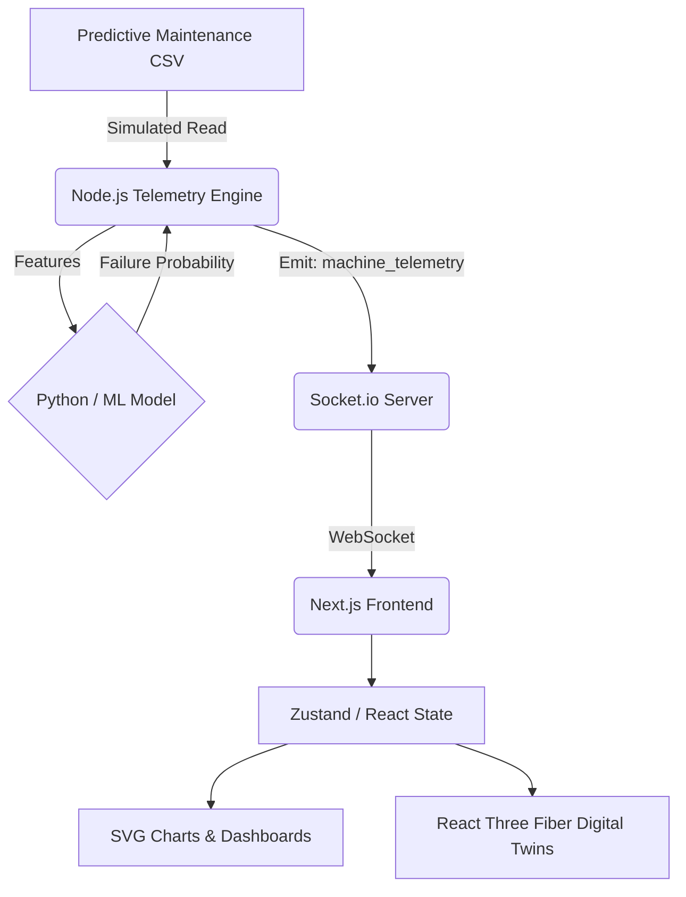

# FacCheckAI 🏭
> Intelligent Predictive Maintenance & Real-time Industrial Digital Twin

## 📖 Project Overview
FacCheckAI is a full-stack, AI-driven predictive maintenance platform engineered to monitor, analyze, and visualize industrial machine health. By combining a realistic simulation of high-frequency sensor telemetry with machine learning, the platform accurately predicts failure probabilities before they cause downtime. 

The system features a real-time WebSocket architecture that feeds live telemetry directly into a sleek, futuristic UI dashboard complete with interactive 3D digital twins.

## 📸 Dashboard Preview
*(Replace with actual screenshot)*


## 🚀 Live Demo
- **Frontend Dashboard:** [faccheck-ai.vercel.app](#) *(Placeholder)*
- **Backend API:** [api.faccheck-ai.com](#) *(Placeholder)*

## ⚠️ Problem Statement
Unplanned downtime in manufacturing and industrial sectors costs millions of dollars annually. Traditional maintenance is purely reactive (fixing things after they break) or rigidly preventative (replacing parts on a strict schedule, regardless of actual wear). There is a critical need to transition to **predictive maintenance**—fixing machines exactly when they are about to fail.

## 💡 Solution Overview
FacCheckAI simulates a modern smart factory environment. It continuously replays historical industrial telemetry data as live streams, analyzing anomalies on the fly using a Random Forest classifier. When the AI detects a high probability of failure based on vibration, pressure, or thermal metrics, it immediately flags the machine on the dashboard, allowing operators to intervene before a catastrophic breakdown occurs.

## ✨ Key Features
- **Real-Time Telemetry Streaming:** WebSocket-powered architecture delivering sub-second sensor updates to the UI.
- **AI Failure Prediction:** Integrated Scikit-Learn Random Forest model that evaluates live telemetry to assign risk levels (NOMINAL, WARNING, CRITICAL).
- **Interactive Digital Twins:** React Three Fiber 3D models representing machines, updating their visual state based on live health data.
- **Dynamic Fleet Filtering:** View and filter specific groups of machines (Conveyors, Robot Arms, etc.).
- **Live Analytical Charts:** Data-driven sparklines and rolling telemetry buffers visualized smoothly using custom, dependency-free SVG manipulation.
- **Event Logging & Alerts:** Automated notification system tracking critical machine events and historical anomalies.

## 🏗️ Technical Architecture
The platform is designed around a decoupled client-server architecture:
1. **The Data Engine:** The Node.js backend loads an open-source predictive maintenance CSV dataset and replays it over time, simulating a live factory floor.
2. **The ML Pipeline:** The backend interacts with a pre-trained Random Forest model to continuously evaluate incoming telemetry arrays.
3. **The Messaging Layer:** Socket.io multiplexes telemetry streams and broadcasts updates to targeted active frontend rooms.
4. **The Presentation Layer:** The Next.js frontend maintains complex immutable rolling buffers in memory, passing this state to custom SVG charts and a 3D canvas renderer.

## 📊 Architecture Flow Diagram


## 📁 Dataset Usage
This project utilizes a historical predictive maintenance dataset containing structured telemetry features (e.g., motor load, vibration, pressure, temperature) and ground-truth failure labels. To accurately simulate a live factory, the Node.js backend reads this static CSV, buffers it into memory, and sequentially emits the rows via WebSockets, replicating the exact behavior of high-frequency hardware sensors.

## 🧠 AI Prediction Engine
- **Model:** Random Forest Classifier (Scikit-learn)
- **Input:** 10-dimensional sensor feature vectors.
- **Output:** Binary classification (Failure / No Failure) mapped to a probabilistic risk score.
- **Workflow:** The model is trained on historical failures. During runtime, it evaluates the live telemetry slice, assigns a risk category, and triggers alerts if the anomaly threshold is breached.

## ⚡ Realtime Telemetry Engine
The application avoids heavy REST polling in favor of a robust Socket.io implementation. The backend maintains active "rooms" based on frontend subscriptions. As a user navigates between the global dashboard and specific machine detail views, the frontend dynamically emits `subscribe` and `unsubscribe` events, ensuring the client only receives telemetry for visible machines, drastically optimizing network bandwidth.

## 🏭 Digital Twin Visualization
Using `three.js` and `@react-three/fiber`, the frontend renders interactive 3D models representing different machine classes. The materials and animations of the 3D meshes are directly bound to the WebSocket state—if a machine overheats or faces critical friction, the digital twin reflects the state visually through material changes and warning UI overlays.

## 🛠️ Tech Stack
**Frontend:**
- React 19 / Next.js 16 (App Router)
- Tailwind CSS v4 (Glassmorphism & Cyber-Industrial UI)
- Socket.io Client
- React Three Fiber / Drei (3D Rendering)
- Framer Motion (Micro-animations)

**Backend:**
- Node.js / Express
- Socket.io
- MongoDB Atlas (Alert/State Persistence)
- Fast CSV Loader

**Machine Learning:**
- Python / FastAPI
- Scikit-learn (Random Forest)
- Pandas / NumPy

## 📂 Project Structure
```text
fac-Check/
├── backend/
│   ├── src/
│   │   ├── models/           # Mongoose schemas
│   │   ├── services/         # CSV Loader, AI inference, Telemetry simulation
│   │   ├── websocket/        # Socket.io room management
│   │   └── index.js          # Entry point
│   └── package.json
├── frontend/
│   ├── src/
│   │   ├── app/              # Next.js routes (Dashboard, Analytics, Machine Detail)
│   │   ├── components/       # Reusable UI, Charts, 3D Models
│   │   ├── lib/              # Socket config, React state management
│   │   └── styles/           # Global CSS variables & Tailwind directives
│   └── package.json
└── README.md
```

## ⚙️ Installation & Setup

1. **Clone the repository:**
```bash
git clone https://github.com/yourusername/FacCheckAI.git
cd FacCheckAI
```

2. **Setup Backend:**
```bash
cd backend
npm install
npm run dev
```

3. **Setup Frontend:**
```bash
cd ../frontend
npm install
npm run dev
```

## 🔐 Environment Variables
**Backend (`backend/.env`):**
```env
PORT=3001
MONGO_URI=mongodb+srv://<user>:<pass>@cluster.mongodb.net/faccheck
CSV_PATH=./predictive_maintenance_dataset.csv
```
**Frontend (`frontend/.env.local`):**
```env
NEXT_PUBLIC_SOCKET_URL=http://localhost:3001
NEXT_PUBLIC_API_URL=http://localhost:3001/api
```

## 📡 API Endpoints
While primary data flows via WebSockets, the REST API supports historical state retrieval:
- `GET /api/machines` - Retrieve registered machine fleet
- `GET /api/alerts` - Fetch recent anomaly logs
- `GET /api/analytics/history` - Fetch historical OEE and Yield metrics

## 🚢 Deployment
- **Frontend:** Deployed on Vercel utilizing optimized Next.js edge functions.
- **Backend:** Hosted on Render / Railway with native WebSocket upgrade support.
- **Database:** MongoDB Atlas serverless cluster.

## 🎯 Challenges Solved
- **Chart Data Consistency & NaNs:** Built an immutable rolling buffer state manager on the frontend that sanitizes corrupt payloads (`Number.isFinite`) and precisely synchronizes dynamic SVG sparklines with updating numeric DOM elements, completely eliminating clipping and NaN errors.
- **Socket Multiplexing & Reconnection:** Eliminated Long-Polling `400 Bad Request` proxy errors by strictly forcing WebSocket TCP transports. Implemented a robust global UI state listener to smoothly handle network drops and reconnect events gracefully without silent failures.
- **React Rendering Bottlenecks:** Optimized the 3D Digital Twin canvas to prevent React from re-rendering the entire WebGL context when overlay UI state changed, segregating the high-frequency telemetry UI from the heavy 3D DOM tree.

## 🔮 Future Enhancements
- Hardware Integration API to allow real PLCs / IoT gateways to replace the CSV simulator.
- Expand the ML pipeline with LSTM neural networks for advanced time-series forecasting.
- VR/AR Digital Twin capabilities utilizing WebXR.

## 👨‍💻 Team Contribution
**My Role:** Frontend-focused Full Stack Development / Product Engineering

**Key Contributions:**
- Architected the Next.js glassmorphism dashboard and futuristic UI/UX.
- Implemented the entire client-side WebSocket synchronization and multiplexing logic.
- Built custom, highly optimized SVG-based telemetry visualization charts from scratch.
- Integrated React Three Fiber to bridge live telemetry with dynamic 3D WebGL models.
- Hardened the frontend-backend data flow to eliminate React race conditions and stale closures.
